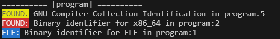

# YAML scan

Finds thing in files with a given YAML rule.

This project is similar to YARA but made in Python. It can be used for finding malware in files or string in files.



<details close>
<summary>Rule use in demo</summary>

```yaml
meta:
    name: "Demo rule" 
    type: "Executable"
    author: "awesomelewis2007"
    version: "V1.0"
    description: "Finds execuatble identifiers"
    date: "15-04-2023"

rules:
  - name: "GNU Compiler Collection Identification"
    description: "Finds files that were compiled with GCC"
    type: "string" 
    report:
      colour: "yellow"
      text: "FOUND:"
    if: "CONTAINS"
    find: "GCC"
    
  - name: "Binary identifier for x86_64"
    description: "Finds files that are compiled for x86_64"
    type: "string" 
    report:
      colour: "red"
      text: "FOUND:"
    if: "CONTAINS"
    find: "x86-64"

  - name: "Binary identifier for ELF"
    description: "Finds files that are compiled for ELF"
    type: "string" 
    report:
      colour: "blue"
      text: "ELF:"
    if: "CONTAINS"
    find: "ELF"
```
</details>

## Example of rule

```yaml

## Example of rule

```yaml
meta:
    name: "Name of the rule"  
    # type: "name" # <-- Optional type of the rule (Vulnerability, Malware, etc.)
    author: "Author"
    version: "V1.0"
    description: "What the rule finds"
    date: "The date of the rule"

rules:
  - name: "Hello world!" # <-- Name of the rule
    description: "Finds the string 'Hello world!' in a file" # <-- Optional description of the rule
    type: "string" # <-- The type of the rule (string or regex)
    report: # <- Optional style for the report
      colour: "blue" # <-- The colour of the message when found (red, yellow, green, blue, purple, cyan, white, magenta)
      text: "FOUND:" # <-- The message when found
    if: "CONTAINS" # <-- The condition of the rule (CONTAINS, STARTS, ENDS)
    find: "Hello world!"
    
  - name: "Find number in file"
    description: "Finds a number in a file using regex"
    type: "regex"
    if: "CONTAINS"
    find: "[0-9]+" # <-- Regex to find a number in a file#
  
  - name: "Find Hello bytes"
    description: "Finds the bytes 'Hello' in a file"
    type: "bytes"
    if: "CONTAINS"
    find: "48 65 6C 6C 6F" # <-- Hex bytes to find in a file
    # Hex can be written as 0x00,0x00 or 00,00 or 00 00 or 0000 you chose YAMLscan will clean it up for you
```

## Usage

```bash
python3 -m YAMLscan <file_to_scan> <rule_file>
```

Or to scan files in a directory and subdirectories:

```bash
python3 -m YAMLscan - <rule_file>
```

You can run `--info <rule_file>` to get info about the rule file.

And if you get stuck you can run `--help` to get help.

## Creating rules

To start creating a rule you can use the [template](examples/blank/blank.yaml) to get started.

Anything that is commented in that file is optional and can be removed. If you see a option like this `option: "abc|def|ghi"` this means you need to remove one option and keep the other. For example if you want to use `option: "abc"` you need to remove `"def|ghi"`. 